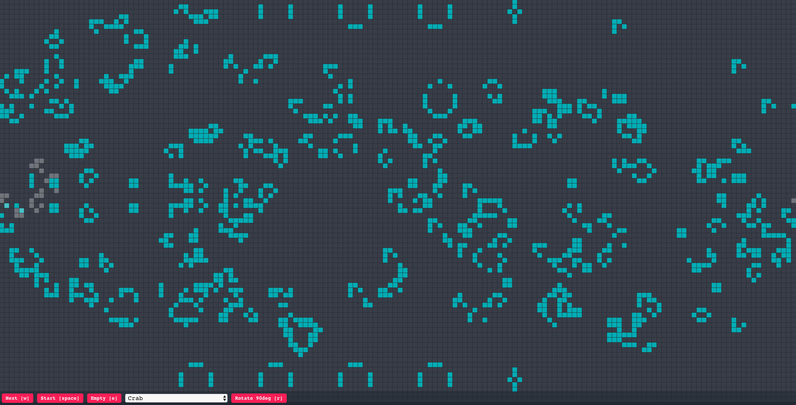

## Conway's game of life with React Hooks and Canvas

This repo contains [Conway's game of life](https://en.wikipedia.org/wiki/Conway%27s_Game_of_Life)
implemented with React Hooks. The board is rendered on `<canvas>` and in memory is represented as
a 1D array (for performance). The app also can parse `.rle` files for easier brush library management.
You can play around with the game [here](https://osvalds.github.io/react-conway/).

This project was bootstrapped with [Create React App](https://github.com/facebook/create-react-app).

## Available Scripts

In the project directory, you can run:

### `npm start`

Runs the app in the development mode. 
Open [http://localhost:3000](http://localhost:3000) to view it in the browser.

The page will reload if you make edits. 
You will also see any lint errors in the console.

### `npm test`

Launches the test runner in the interactive watch mode. 
See the section about [running tests](https://facebook.github.io/create-react-app/docs/running-tests) for more information.

### `npm run build`
